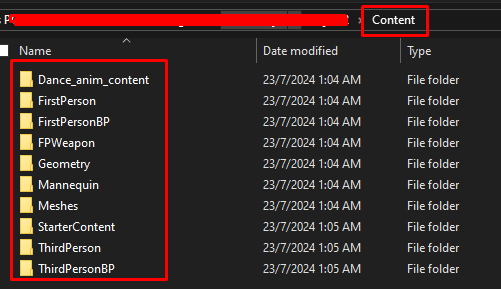
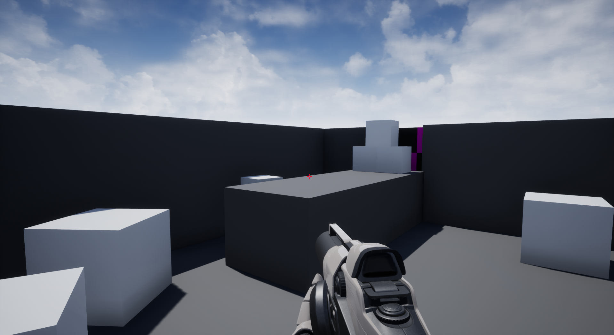
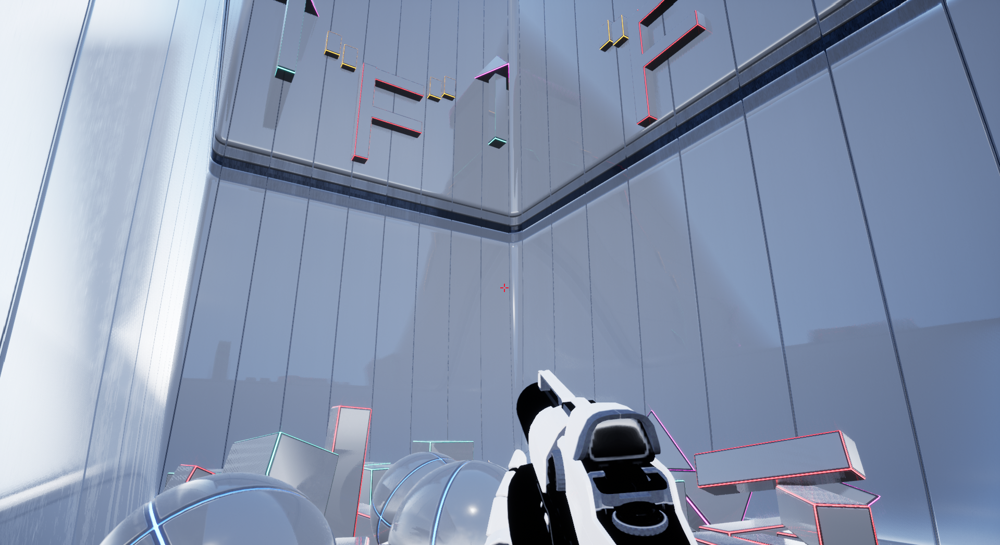
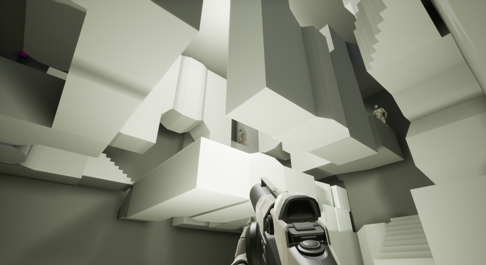
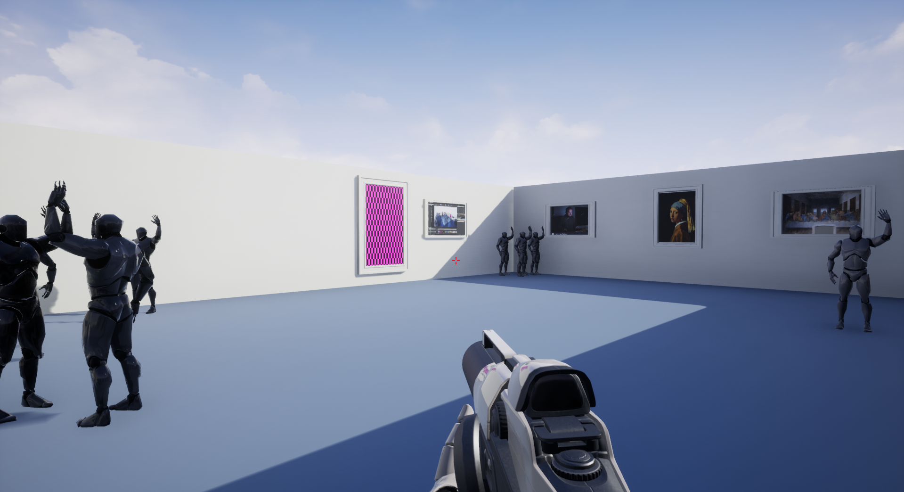
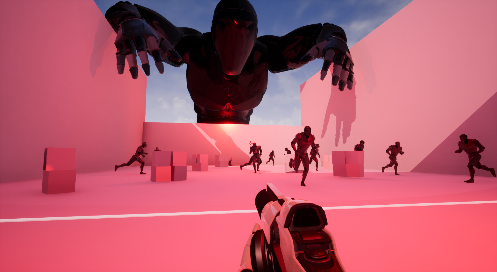
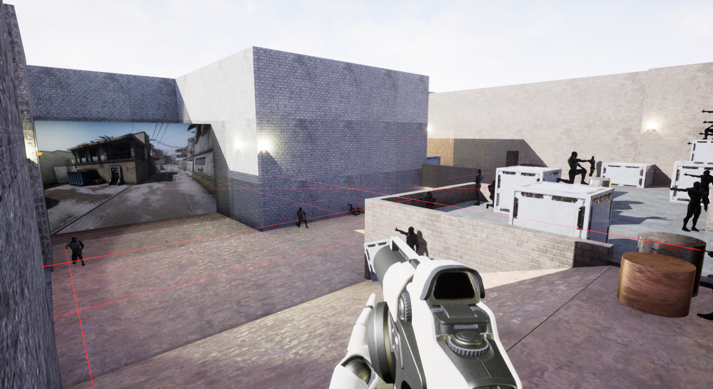
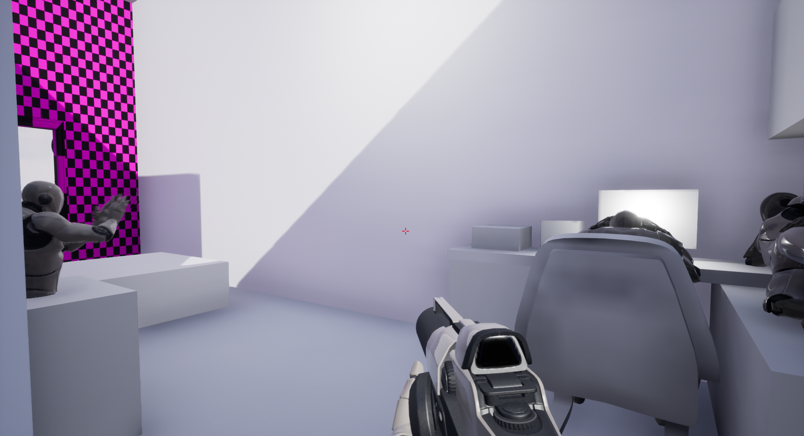
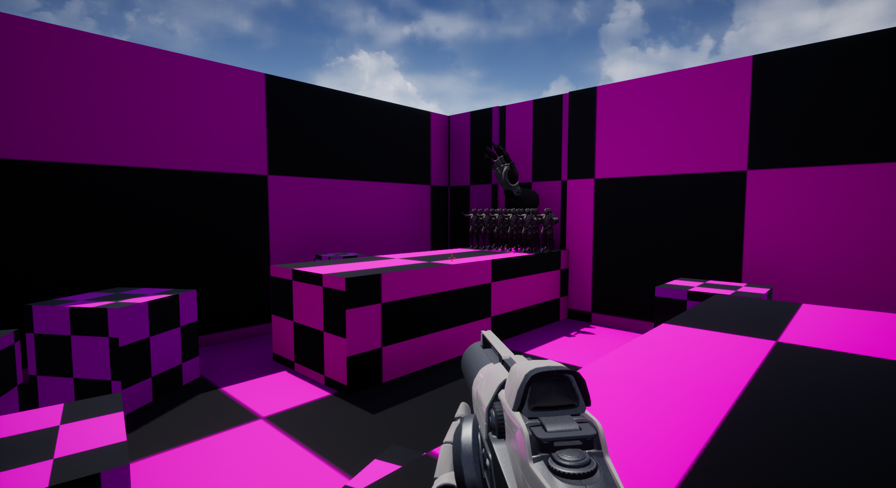

# Escape The UE Project

## Group Members
- **Iqmal Daniel Bin Ahmad Affandi** [Student ID: 1191103284]

## Introduction
"Escape The UE Project" is a surreal exploration game where a player finds themselves trapped inside an unfinished Unreal Engine project. The game blends familiar mechanics with bizarre, glitchy environments, challenging players to navigate through a series of increasingly surreal levels to finally escape the confines of a broken digital world.

## Documentation of the Game
This game begins in a basic Unreal Engine first-person shooter template, requiring players to utilize both platforming and shooting mechanics to progress. Each level introduces new "glitches" or mechanics, designed to emulate common development bugs or unfinished features, turning them into gameplay elements:
1. **Start Level**: Utilize jumping and shooting to navigate and break through a wall with a missing texture.
2. **Look Up**: Triggered by looking up and pressing 'F', launching the player upward to reach the goal.
3. **Parkour Launch**: Use parkour skills and launchpads to navigate to the level's end.
4. **Invisible Maze**: Navigate through an invisible maze designed as an abstract art gallery.
5. **DeathFloor**: Follow a hidden path guided by mannequins running from a threat; stepping off the path results in falling.
6. **de_pasir**: Dodge mannequins in a homage to the famous Counter-Strike map "de_dust", with mannequins posing threats with laser weapons.
7. **MyHouse**: Explore a surreal version of a house, interact with dancing mannequins, and discover easter eggs.
8. **Final Level**: Navigate through a repeating and degrading environment that eventually "crashes" the game as a form of escape.

## User Manual / Instructions
### Installation
Follow these steps to install "Escape The UE Project":

1. **Clone the Repository**:
   - Clone the project files from GitHub:
     ```
     git clone https://github.com/IqmalDaniel20/Escape-The-Unreal-Engine-Project
     ```

2. **Download Additional Assets**:
   - Some game assets are too large for GitHub and are hosted separately. Download the additional `.zip` file from Google Drive:
     [Download Content.zip](https://drive.google.com/drive/folders/11Vlu9LjrDDNrUfhpxuG7v0zr9tv0xKkk?usp=sharing)

3. **Install the Content**:
   - Place the downloaded `Content.zip` file into the root directory of the cloned project.
   - Extract the `Content.zip` file directly into this folder, ensuring that all assets populate the `Content` folder of your Unreal project.
   - See the screenshot below to verify that your `Content` folder is set up correctly:

     

4. **Run the Game**:
   - Open the Unreal Engine project file (`*.uproject`) with Unreal Engine.
   - Press 'Play' in the Unreal Engine editor to start the game, or package the project for your preferred platform.

### How to Play
- **Movement**: WASD keys.
- **Aim**: Mouse movement.
- **Shoot**: Left mouse button.
- **Interact/Use**: Press 'F'. (Only used in **Level 2**)

### Special Features
- Unique interaction with game "glitches" as mechanics.
- Surreal environments that blend reality with digital artifacts.
- Easter eggs that provide humorous and unexpected interactions.

## Screenshots

### Level 1: Start Level


### Level 2: Look Up


### Level 3: Parkour Launch


### Level 4: Invisible Maze


### Level 5: DeathFloor


### Level 6: de_pasir


### Level 7: MyHouse


### Level 8: Final Level



## Video Demo
Watch the gameplay and feature demonstration of "Escape The UE Project" on YouTube:
[Escape The UE Project - Video Demo](https://youtu.be/yZ2yO2pC1nE)

## Acknowledgments
I would like to thank our instructor, Mr. Wong Ya Ping, for the guidance and support throughout this project. Special thanks to the Unreal Engine Community as well. I also appreciate the feedback and suggestions from our classmates.

## References
Materials and inspiration were drawn from various Unreal Engine community resources and tutorials, all used under fair use for educational purposes.

[Music Used in the Easter Egg Room][Raffaella Carrà - Pedro (Jaxomy & Agatino Romero Remix)](https://www.youtube.com/watch?v=kKL20WFmVrw)

[Texture/Material Used for Missing Texture][Missing Texture From Source Game (Gmod, Counter Strike,.etc)](https://steamcommunity.com/sharedfiles/filedetails/?id=2946118759)

[Dance Animation Used in the Easter Egg Room][Mixamo Dance Pack by TerribiliStudio](https://terribilisstudio.fr/?section=MD)

[Map Design for Level 6 (de_pasir)][References taken from de_dust](https://en.wikipedia.org/wiki/Dust_II)

[Map Design for Level 7 (My House)[References taken from, my actual house, yup...]


